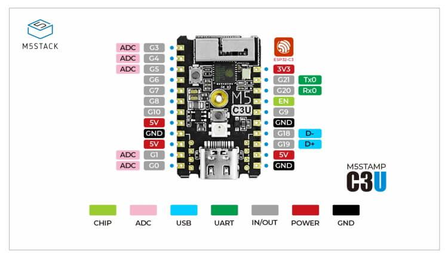

# esphome setup

## esphome

Note: the esphome version is in the form `YYYY.MM` e.g. 2022.11
### initialize new boad config
```podman run --rm -v ${PWD}:/config -it docker.io/esphome/esphome:${esp_version} wizard ${board-config}.yaml```

### upload initially via device
```podman run --rm -v "${PWD}":/config --device=/dev/ttyUSB0 -it docker.io/esphome/esphome:${esp_version}run ${board-config}.yaml```

### upload initially via ota
```podman run --rm -v "${PWD}":/config -it docker.io/esphome/esphome:${esp_version} run ${board-config}.yaml```

## esphome assistant
this is for debugging without having [home assistant](https://www.home-assistant.io/)

```podman run --rm --net=host -v "${PWD}":/config -it docker.io/esphome/esphome:${esp_version}```

# board FYI:
## m5stamp c3u
Q: How to setup board UART device:
A: Initially press button G9 while connecting to pc power to enable uart (RGB led should not be lit)

Q: How to enable device:
A: Set the following rule via file `/etc/udev/rules.d/m5stamp-c3u.rules` with content `KERNEL=="ttyACM[0-9]*", MODE="0666"`

Q: pinout


## az-delivery esp32 v4

Q: pinout

