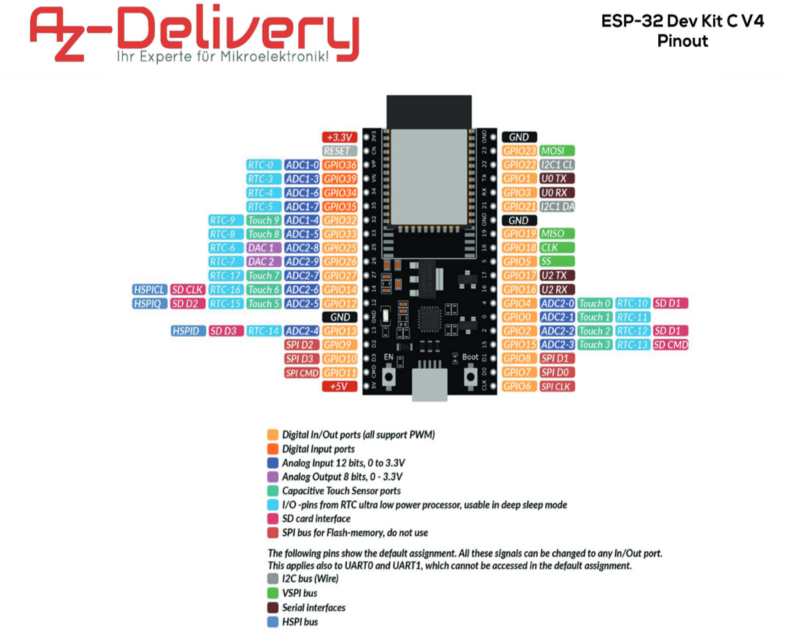

# esphome setup

## esphome

Note: the esphome version is in the form `YYYY.MM` e.g. 2022.11
### initialize new boad config
```podman run --rm -v ${PWD}:/config -it docker.io/esphome/esphome:${esp_version} [-s KEY VALUE] wizard ${board-config}.yaml```

### upload via ota or /dev/
```podman run --rm -v "${PWD}":/config [--device=${device}] -it docker.io/esphome/esphome:${esp_version} [-s KEY VALUE] run ${board-config}.yaml```

specify device always, when the board is new, later you can omit the device flag to use wifi.
It can be used, when you want to rename the wifi or use the rename functionality of esphome.

## esphome assistant
this is for debugging without having [home assistant](https://www.home-assistant.io/)

```podman run --rm --net=host -v "${PWD}":/config -it docker.io/esphome/esphome:${esp_version}```

# configurations
A configuration specifies a type of sensor.

A `secrets.yaml` file is needed in order to be able to compile the configs to a uploadable file.
See `secrets.yaml.example` as an example file.

## enviromnemt-mm.yaml
Environment sensors sense Humidity and Temperature.
Specify the location of the sensor via `-s location $value` where value is the location.
Currently `sleep` and `office` are supported.

# board FYI:
## m5stamp c3u
Q: How to setup board UART device?

A: Initially press button G9 while connecting to pc power to enable uart (RGB led should not be lit)

Q: How to enable device?

A: Set the following rule via file `/etc/udev/rules.d/m5stamp-c3u.rules` with content `KERNEL=="ttyACM[0-9]*", MODE="0666"`

Q: pinout


## az-delivery esp32-devkitc-v4

Q: pinout

