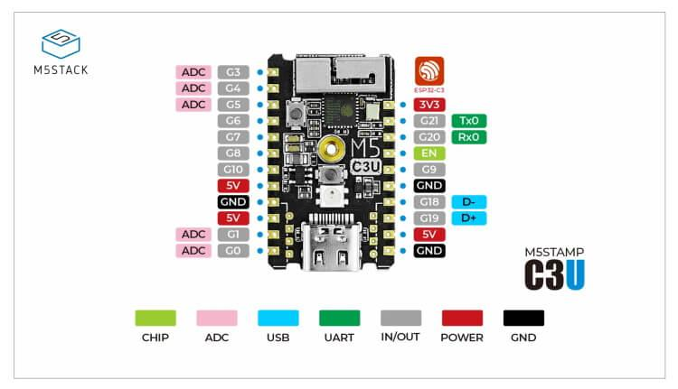

# Boards

Boards are specific [modules](../modules/readme.md) which define a board.

A board should be included as a package.

Only one board must be included.

A board usually only defines the main `esphome`- and `esp32`/`esp8266`-objects.

```yaml
substritutions:
  # needed substitutions:
  # name:

esphome:
  name: ${name}
  min_version: '<esp-home-minimum-version>' # e.g. 2022.11

esp32:
  board: <board-type>
  framework:
    type: arduino
```

## Example include yaml

```yaml
packages:
  board: !include boards/<board-name>.yaml
```

## Board FAQ

### m5stack stamp-c3u
Q: How to setup board UART device?

A: Initially press button G9 while connecting to pc power to enable uart (RGB led should not be lit)


Q: How to enable device?

A: Set the following rule via file `/etc/udev/rules.d/m5stack-stamp-c3u.rules` with content `KERNEL=="ttyACM[0-9]*", MODE="0666"`


Q: pinout
A: 

### az-delivery esp32-devkitc-v4

Q: pinout
A: 